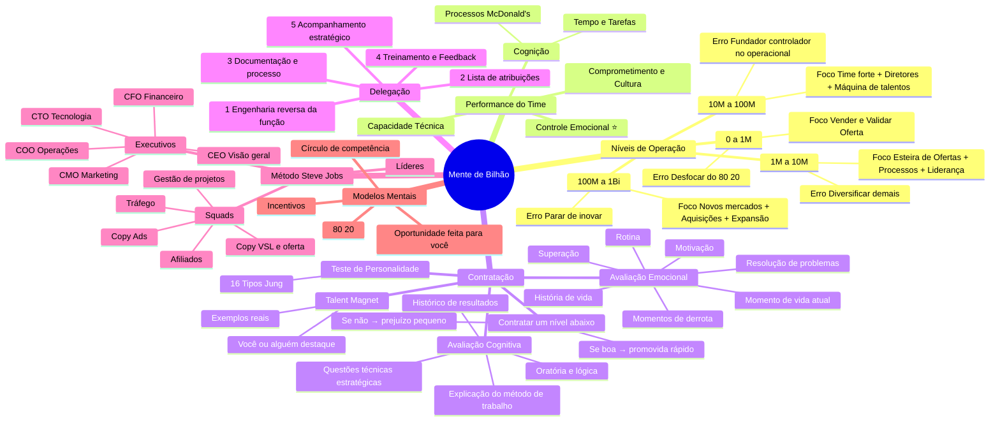

# Tiago Filemon — Quinta dos Empresários

> *"O erro fatal do empresário: parar de inovar e ficar lento e burocrático."*

---

## 🗺️ Mapa Mental



---

## 📊 Níveis de Operação

| Fase | Foco | Erro fatal |
|---|---|---|
| **0 a 1M** | Vender — validar oferta. Fazer dinheiro e dane-se o resto. | Desfocar do 80/20 e gastar tempo com burocracia |
| **1M a 10M** | Esteira de ofertas + Processos + Liderança → Previsibilidade | Diversificar demais: nichos, modelos de negócio etc. |
| **10M a 100M** | Time forte + Diretores + Máquina de talentos + Cultura → ter um negócio de verdade | Fundador controlador ou ainda no operacional + contratar gente pior que ele |
| **100M a 1Bi** | Novos mercados + Aquisições + Expansão → dominação e monopólio | Parar de inovar + ficar lento e burocrático |

> 💡 Cada fase exige um empresário diferente. O que te trouxe até 1M vai te travar de 1M a 10M.

---

## ⚡ O Erro Fatal do Empresário

**Parar de inovar + ficar lento e burocrático**

> 📚 **"Good to Great" — Jim Collins:** empresas que deixam de crescer não caem de repente — elas entram em um ciclo de burocracia gradual que sufoca a inovação antes de destruir os resultados. O antídoto é manter a cultura de disciplina *e* inovação ao mesmo tempo.

---

## 👥 Performance do Time

| Pilar | Peso |
|---|---|
| ⭐ Controle Emocional | Mais importante |
| 🧠 Cognição | Alto |
| 🔧 Capacidade Técnica | Médio |
| 🔥 Comprometimento/Cultura | Alto |

**Cognição na prática:**
- **Tempo e tarefas** — como a pessoa organiza e prioriza o que precisa ser feito
- **Processos** — pensa como o McDonald's: o processo é tão bom que qualquer pessoa consegue executar

> 📚 **"Principles" — Ray Dalio:** a performance de um time depende muito mais dos modelos mentais e do nível de consciência das pessoas do que da capacidade técnica isolada. Pessoas com alta inteligência emocional aprendem habilidades; o contrário raramente acontece.

> 📚 **"High Output Management" — Andy Grove:** a função do líder é maximizar o output do time, não o seu próprio. O controle emocional do líder contamina (para o bem ou mal) toda a equipe.

---

## 🎯 Contratação

### Passo 1 — Teste de Personalidade
- **16 Tipos Psicológicos de Jung**
- Identifica como a pessoa processa informação e toma decisões

> 📚 **"Who" — Geoff Smart & Randy Street:** o método A de contratação usa entrevistas estruturadas em camadas, começando sempre pelo perfil comportamental antes de avaliar competência técnica. A maioria das demissões acontece por desalinhamento de valores, não por falta de técnica.

---

### Passo 2 — Avaliação Emocional

Perguntas que revelam quem a pessoa é de verdade:

- **História de vida:** momentos de derrota, superação, resolução de problemas
- **Momento de vida atual:** o que está vivendo agora
- **Rotina:** como organiza o dia
- **Motivação:** o que a move de verdade

> 📚 **"Extreme Ownership" — Jocko Willink:** pessoas que assumem responsabilidade pelos próprios erros (sem culpar o ambiente) são as que evoluem. Na entrevista, observe se a pessoa narra derrotas com ownership ou com desculpas.

---

### Passo 3 — Avaliação Cognitiva

- Oratória e lógica nos argumentos
- Explicação detalhada do processo/método de trabalho
- Histórico de resultados mensuráveis
- Questões técnicas que exijam planejamento e visão estratégica da função

> 📚 **"Scaling Up" — Verne Harnish:** contrate pela capacidade de pensar em sistemas, não só de executar tarefas. Quem sabe explicar *como* chegou aos resultados é quem consegue replicar e escalar.

---

### Passo 4 — Estratégia de Nível

**Contratar um nível abaixo do que a pessoa é:**
- Se for boa → será promovida rápido e você ganha lealdade
- Se não for → o prejuízo é pequeno, sem grandes riscos

---

### Talent Magnet — Como Encontrar Talentos

**Você ou um funcionário/sócio destaque que faça esse papel de ímã.**

Exemplos reais citados por Tiago:
| Empresa | Talent Magnet |
|---|---|
| Bhever | Tiago Filemon |
| Six | Derick |
| FEG | Angélica |
| Instituto | Diogo Gomes |
| Empresa Elton | Denis |

> 📚 **"Built to Last" — Jim Collins:** empresas duradouras constroem mecanismos de atração de talento — a cultura e o líder visível funcionam como ímã antes de qualquer vaga ser publicada.

---

## 🔁 Delegação — Passo a Passo

```
1️⃣  Engenharia reversa da função
        ↓
2️⃣  Lista de atribuições do cargo
        ↓
3️⃣  Documentação e criação de processo
        ↓
4️⃣  Treinamento e Feedback contínuo
        ↓
5️⃣  Acompanhamento estratégico + apoio na tomada de decisões
```

> 📚 **"The E-Myth" — Michael Gerber:** o empresário que não documenta seus processos cria uma empresa que depende dele para tudo. Delegar sem processo é só transferir caos. A documentação transforma o que você faz em um sistema que outros podem operar.

> 📚 **"Traction" — Gino Wickman (EOS):** o sistema de delegação eficaz exige que cada função tenha um "dono" claro com métricas definidas. Sem isso, responsabilidade vira conversa.

---

## ⚙️ Método Steve Jobs — Estrutura de Time

### Squads (Células de Execução)
- 🎯 Tráfego
- ✍️ Copy Ads
- 🎬 Copy VSL / Oferta
- 🤝 Afiliados
- 📋 Gestão de Projetos

### Líderes
Respondem pelos squads, gerenciam execução e resultado

### Executivos (C-Level)
| Cargo | Responsabilidade |
|---|---|
| CEO | Visão geral e direção |
| CMO | Marketing |
| CFO | Financeiro |
| COO | Operações |
| CTO | Tecnologia |

> 📚 **"Scaling Up" — Verne Harnish:** a estrutura de liderança em camadas (squads → líderes → executivos) é o que permite escalar sem o CEO virar gargalo. Cada camada tem autonomia dentro de um contexto claro.

> 📚 **"Blitzscaling" — Reid Hoffman:** a velocidade de escala exige times especializados (squads) com ownership claro. Generalistas são essenciais no início; especialistas por função são essenciais na escala.

---

## 🧠 Modelos Mentais Aplicados à Gestão

### Círculo de Competência
Foque em contratar e delegar dentro do que você realmente conhece. Não expanda antes de dominar o core.

### Incentivos
As pessoas fazem o que são incentivadas a fazer — não o que você pede. Estruture bonificações e reconhecimento alinhados aos resultados que importam.

### 80/20 (Pareto)
20% das pessoas geram 80% dos resultados. Identifique, proteja e invista nessas pessoas.

### Oportunidade Feita para Você
Algumas contratações e posições são feitas para o perfil exato que você tem — reconheça quando a oportunidade é natural vs. forçada.

> 📚 **"Poor Charlie's Almanack" — Charlie Munger:** a grade de modelos mentais é a ferramenta mais poderosa para tomada de decisão. Quem usa só um modelo erra sistematicamente. Incentivos são o modelo mental mais subestimado na gestão de times.

---

## 📌 Insights para Aplicar

- [ ] Revisar processo de contratação atual com os 3 níveis de avaliação
- [ ] Criar ficha de avaliação emocional para entrevistas
- [ ] Mapear quem é o Talent Magnet da empresa agora
- [ ] Documentar pelo menos 1 função usando o passo a passo de delegação
- [ ] Definir os executivos (mesmo que informais) para cada área

---

## 🔗 Referências

- [[people/tiago-filemon.md]]
- 📚 Good to Great — Jim Collins
- 📚 Who — Geoff Smart & Randy Street
- 📚 Principles — Ray Dalio
- 📚 High Output Management — Andy Grove
- 📚 The E-Myth — Michael Gerber
- 📚 Traction — Gino Wickman
- 📚 Scaling Up — Verne Harnish
- 📚 Extreme Ownership — Jocko Willink
- 📚 Poor Charlie's Almanack — Charlie Munger
